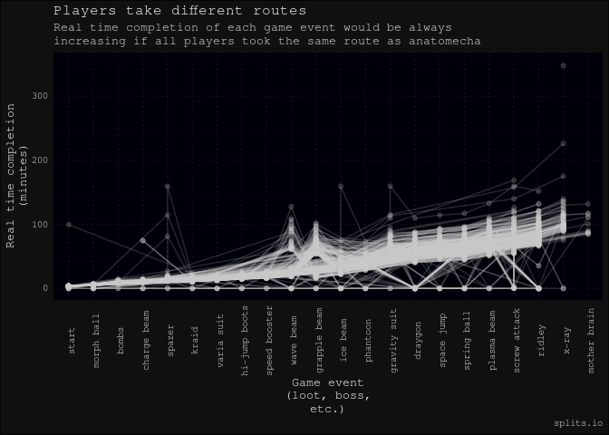
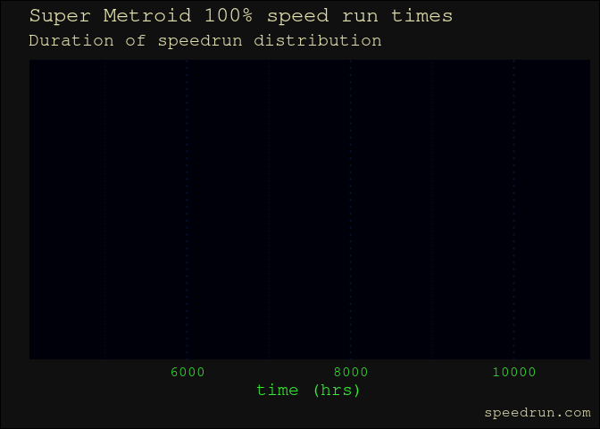
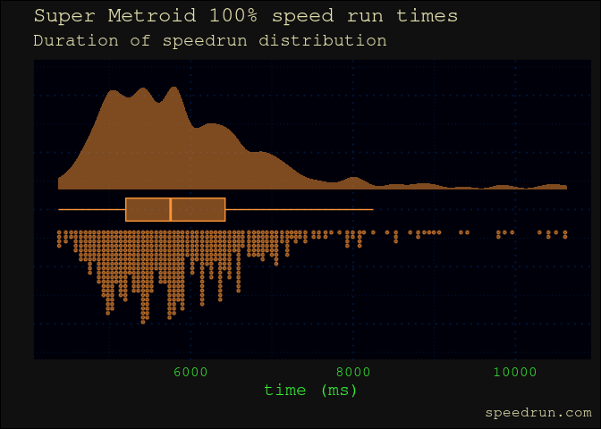
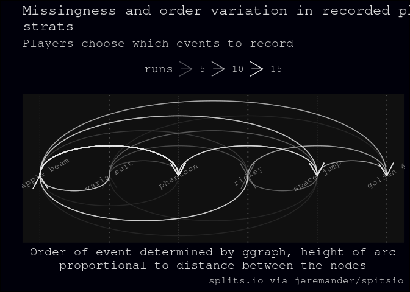
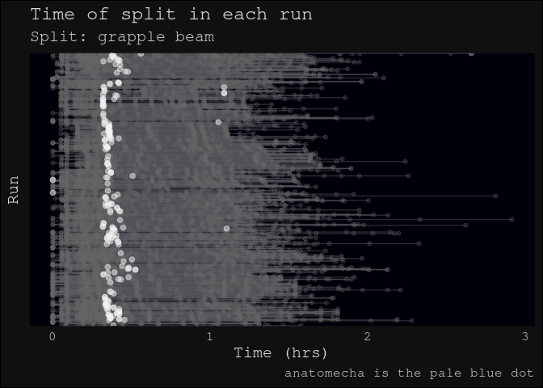
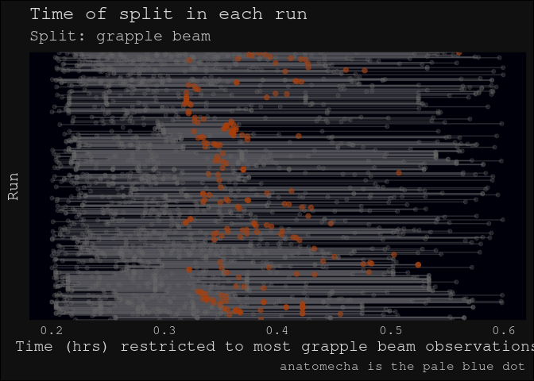

- [supermetroid](#supermetroid)
- [What is Super Metroid?](#what-is-super-metroid)
  - [Super Metroid speed running](#super-metroid-speed-running)
  - [Example: Load speedrun.com leaderboard data and visualise
    distribution](#example-load-speedruncom-leaderboard-data-and-visualise-distribution)
  - [Tools used in this analysis](#tools-used-in-this-analysis)
  - [The data](#the-data)
    - [Open Python speed runner API
      implementations](#open-python-speed-runner-api-implementations)
- [Articles](#articles)
- [Analyses (work in progress)](#analyses-work-in-progress)
  - [Colour palette is in experimental/grab whatever colours
    phase](#colour-palette-is-in-experimentalgrab-whatever-colours-phase)
  - [Speed run times from
    speedrun.com](#speed-run-times-from-speedruncom)
    - [Where are Super Metroid
      players?](#where-are-super-metroid-players)
  - [Routes players take](#routes-players-take)
    - [Different routes](#different-routes)
    - [Missingness of routes](#missingness-of-routes)
  - [All the runs](#all-the-runs)
  - [Super Metroid and speed running](#super-metroid-and-speed-running)
    - [Super Metroid is the top SNES speed runner
      game](#super-metroid-is-the-top-snes-speed-runner-game)
    - [Subway Surfers TikTok phenomenon or good upload
      interface?](#subway-surfers-tiktok-phenomenon-or-good-upload-interface)

<!-- README.md is generated from README.Rmd. Please edit that file -->

# supermetroid

<!-- badges: start -->
<!-- badges: end -->

This packaged analysis accompanies [PyData Copenhagen June
2023](https://www.meetup.com/pydata-copenhagen/events/294210771/) is
best viewed on the [package
site](https://softloud.github.io/supermetroid).

Super Metroid speed run data is captured from leaderboards, and analysed
to answer the following question, posed by `anatomecha`, a Super Metroid
speed runner.

> `anatomecha`: At what times do Super Metroid 100% speed runs get
> competitive?

# What is Super Metroid?

> While the exploration-focused platformers known as Metroidvanias
> derive their genre name from two different series, there’s one game
> they’re all judged by. Super Metroid wasn’t the first Metroidvania,
> the first Metroid game also had the focus on exploring a large
> interconnected map and using new abilities to open up new areas, but
> its polish, visual direction, and atmosphere all created a more
> involved experience than its predecessors. Released in 1994, Super
> Metroid’s shadow looms over every game in the genre since… -
> [thegamehoard
> 2022](https://thegamehoard.com/2022/04/24/50-years-of-video-games-super-metroid-snes/)


## Super Metroid speed running

As part of the verification of their speed run results, many players
upload a video of the run to youtube. Here is `anatomecha` speed running
Super Metroid and capturing time points.

<iframe width="560" height="315" src="https://www.youtube.com/embed/hNglm3KxCHQ" title="YouTube video player" frameborder="0" allow="accelerometer; autoplay; clipboard-write; encrypted-media; gyroscope; picture-in-picture; web-share" allowfullscreen>
</iframe>

This analysis focuses on 100% speedruns wherein players traverse a map
using different routes to collect all loot and defeat all bosses. Speed
runners try to do this as fast as possible, and log their results on
leaderboards such as
[speedrun.com](https://www.speedrun.com/supermetroid?h=100&x=xd1mpewd)
or splitsio.

A core feature of the game is that there are many routes through the
map. These routes are often hidden in seemingly impassable walls, or
require solving a puzzle.

<div class="figure" style="text-align: center">


<p class="caption">
image source: metroid.retropixel.net
</p>

</div>

Speed runners hone their skills by mastering techniques to improve their
speed in collecting all loot and defeating all bosses in a 100% run
through of the game.

## Example: Load speedrun.com leaderboard data and visualise distribution

``` r
# install R-packaged analysis
install.packages("devtools")
devtools::install_github("softloud/supermetroid")
```

``` r
# example: access speedrun.com leaderboard
library(supermetroid) # analysis code

# take a look at observations
src_df %>% head()
#>   rank  player_name       date      t_s      location player_id   run_id
#> 0    1    ShinyZeni 2021-07-31 4373.000 United States  zxzno3ex z5do82dm
#> 1    2        zoast 2021-02-24 4375.000         Palau  18v6k4nx yo75d4dm
#> 2    3   Behemoth87 2021-12-08 4375.930       England  zxz2wy4x m36d0q6m
#> 3    4        Gebbu 2023-05-08 4392.000        Norway  xk49m26j m3qo724y
#> 4    5 Static_Shock 2023-06-10 4438.367        Brazil  x35ve3kj m3qrx76y
#> 5    6   Oatsngoats 2020-09-08 4478.000 United States  zx7q0k08 z1odq09m

# visualise observations in a raincloud plot
src_df %>% 
  all_run_raincloud(
    base_size = 15 # set font size
  )
```


``` r

# how to do all this in Python?
# so much to learn
```

## Tools used in this analysis

``` r
# Other R packages used in this document
library(tidyverse) # data science tools
library(gt) # for html tables
library(ggraph) # graphs
library(tidygraph) # graphs
```

## The data

Player rankings are sourced from [speedrun.com](https://speedrun.com/)’s
leaderboard.

``` r
src_df %>% head()
#>   rank  player_name       date      t_s      location player_id   run_id
#> 0    1    ShinyZeni 2021-07-31 4373.000 United States  zxzno3ex z5do82dm
#> 1    2        zoast 2021-02-24 4375.000         Palau  18v6k4nx yo75d4dm
#> 2    3   Behemoth87 2021-12-08 4375.930       England  zxz2wy4x m36d0q6m
#> 3    4        Gebbu 2023-05-08 4392.000        Norway  xk49m26j m3qo724y
#> 4    5 Static_Shock 2023-06-10 4438.367        Brazil  x35ve3kj m3qrx76y
#> 5    6   Oatsngoats 2020-09-08 4478.000 United States  zx7q0k08 z1odq09m
```

In addition to ranking data from speedrun.com’s leaderboards, this
analysis incorporates timepoints observed for game events (of the
player’s choosing, frustratingly).

Speed runners use an open source plugin for the open source emulator
favoured by SNES Super Metroid (1994) speed runners.

``` r
# whyfor error?
knitr::include_graphics("vignettes/splits_screenshot.PNG")
#> Error in knitr::include_graphics("vignettes/splits_screenshot.PNG"): Cannot find the file(s): "vignettes/splits_screenshot.PNG"
```

These observations are captured in a .lss file that can be uploaded to
[splitsio](https://splits.io/).

``` r
sio_df %>% head()
#>   supermetroid_label player_name           game_event segment_number
#> 1         morph ball  anatomecha        Morphing Ball              0
#> 2               <NA>  anatomecha       First Missiles              1
#> 3              bombs  anatomecha                 Bomb              2
#> 4               <NA>  anatomecha First Super Missiles              3
#> 5        charge beam  anatomecha          Charge Beam              4
#> 6             spazer  anatomecha               Spazer              5
#>   realtime_start_ms                           segment_id run_id player_id
#> 1                 0 69d90da3-1634-4af4-9096-419a32bedd0a   ato1     89646
#> 2            200835 fad50319-d55b-460e-923a-c416f233daea   ato1     89646
#> 3            224926 089daf0b-64c3-4eec-8902-022335b2b179   ato1     89646
#> 4            358321 2a215dcd-2989-4939-8558-a7215904dfd1   ato1     89646
#> 5            589662 e906991d-e919-47c1-a809-2b4da9b67461   ato1     89646
#> 6            709962 10439232-43c7-4752-afb9-ee23782da4a9   ato1     89646
#>   realtime_duration_ms realtime_end_ms realtime_shortest_duration_ms
#> 1               200835          200835                        200835
#> 2                24091          224926                         23286
#> 3               133395          358321                        129371
#> 4               231341          589662                        227335
#> 5               120300          709962                        120299
#> 6                97876          807838                         95884
#>   realtime_gold         split_player                split
#> 1          TRUE        morphing ball        morphing ball
#> 2         FALSE       first missiles       first missiles
#> 3         FALSE                 bomb                 bomb
#> 4         FALSE first super missiles first super missiles
#> 5         FALSE          charge beam          charge beam
#> 6         FALSE               spazer               spazer
```

### Open Python speed runner API implementations

Jeremy Silver maintains a Python implentation
[`splitsio`](https://github.com/jeremander/splitsio) of the [REST
API](https://github.com/glacials/splits-io/blob/master/docs/api.md) that
provides players’ timepoint observations of game events from
[splitsio](https://splits.io/). @jeremander’s consultation on this
analysis provided key answers to questions of [what was and was not
possible with the
data](https://github.com/jeremander/splitsio/issues/1).

Player ranks from speedrun.com were accessed via the Python
implementation [`srcomapi`](https://github.com/blha303/srcomapi) of the
[REST API](https://github.com/speedruncomorg/api) for
[speedrun.com](https://speedrun.com/).

# Articles

| Vignette                    | Description                                                                              |
|-----------------------------|------------------------------------------------------------------------------------------|
| [data schema](#data-schema) | Plan for what data to extract for analysis                                               |
| player-rank                 | Combine speedrun.com and splits.io data                                                  |
| src                         | Scrape supermetroid.com data using `srcomapi`                                            |
| sio                         | Scrape splits.io data using `splitsio`; data is not labelled in this vignette. Raw data. |
| splits                      | Use anatomecha’s labels to update split strings                                          |
| route-matching              | Explore the missingness of routes recorded by players                                    |
| route-graph                 | Graphs of routes players take                                                            |
| identifying-routes          | Classifying routes players take                                                          |
| player-locations            | Exploring differences in players across locations                                        |

# Analyses (work in progress)

## Colour palette is in experimental/grab whatever colours phase

<div class="tenor-gif-embed" data-postid="10436793"
data-share-method="host" data-aspect-ratio="1.3369" data-width="100%">

<a href="https://tenor.com/view/no-sir-i-dont-like-it-horse-gif-10436793">No
Sir I Dont Like It GIF</a>from
<a href="https://tenor.com/search/no+sir-gifs">No Sir GIFs</a>

</div>

<script type="text/javascript" async src="https://tenor.com/embed.js"></script>

## Speed run times from speedrun.com


- [ ] interpretable x axis


<div id="gcpbtfpkjm" style="padding-left:0px;padding-right:0px;padding-top:10px;padding-bottom:10px;overflow-x:auto;overflow-y:auto;width:auto;height:auto;">
<style>#gcpbtfpkjm table {
  font-family: system-ui, 'Segoe UI', Roboto, Helvetica, Arial, sans-serif, 'Apple Color Emoji', 'Segoe UI Emoji', 'Segoe UI Symbol', 'Noto Color Emoji';
  -webkit-font-smoothing: antialiased;
  -moz-osx-font-smoothing: grayscale;
}
&#10;#gcpbtfpkjm thead, #gcpbtfpkjm tbody, #gcpbtfpkjm tfoot, #gcpbtfpkjm tr, #gcpbtfpkjm td, #gcpbtfpkjm th {
  border-style: none;
}
&#10;#gcpbtfpkjm p {
  margin: 0;
  padding: 0;
}
&#10;#gcpbtfpkjm .gt_table {
  display: table;
  border-collapse: collapse;
  line-height: normal;
  margin-left: auto;
  margin-right: auto;
  color: #333333;
  font-size: 16px;
  font-weight: normal;
  font-style: normal;
  background-color: #FFFFFF;
  width: auto;
  border-top-style: solid;
  border-top-width: 2px;
  border-top-color: #A8A8A8;
  border-right-style: none;
  border-right-width: 2px;
  border-right-color: #D3D3D3;
  border-bottom-style: solid;
  border-bottom-width: 2px;
  border-bottom-color: #A8A8A8;
  border-left-style: none;
  border-left-width: 2px;
  border-left-color: #D3D3D3;
}
&#10;#gcpbtfpkjm .gt_caption {
  padding-top: 4px;
  padding-bottom: 4px;
}
&#10;#gcpbtfpkjm .gt_title {
  color: #333333;
  font-size: 125%;
  font-weight: initial;
  padding-top: 4px;
  padding-bottom: 4px;
  padding-left: 5px;
  padding-right: 5px;
  border-bottom-color: #FFFFFF;
  border-bottom-width: 0;
}
&#10;#gcpbtfpkjm .gt_subtitle {
  color: #333333;
  font-size: 85%;
  font-weight: initial;
  padding-top: 3px;
  padding-bottom: 5px;
  padding-left: 5px;
  padding-right: 5px;
  border-top-color: #FFFFFF;
  border-top-width: 0;
}
&#10;#gcpbtfpkjm .gt_heading {
  background-color: #FFFFFF;
  text-align: center;
  border-bottom-color: #FFFFFF;
  border-left-style: none;
  border-left-width: 1px;
  border-left-color: #D3D3D3;
  border-right-style: none;
  border-right-width: 1px;
  border-right-color: #D3D3D3;
}
&#10;#gcpbtfpkjm .gt_bottom_border {
  border-bottom-style: solid;
  border-bottom-width: 2px;
  border-bottom-color: #D3D3D3;
}
&#10;#gcpbtfpkjm .gt_col_headings {
  border-top-style: solid;
  border-top-width: 2px;
  border-top-color: #D3D3D3;
  border-bottom-style: solid;
  border-bottom-width: 2px;
  border-bottom-color: #D3D3D3;
  border-left-style: none;
  border-left-width: 1px;
  border-left-color: #D3D3D3;
  border-right-style: none;
  border-right-width: 1px;
  border-right-color: #D3D3D3;
}
&#10;#gcpbtfpkjm .gt_col_heading {
  color: #333333;
  background-color: #FFFFFF;
  font-size: 100%;
  font-weight: normal;
  text-transform: inherit;
  border-left-style: none;
  border-left-width: 1px;
  border-left-color: #D3D3D3;
  border-right-style: none;
  border-right-width: 1px;
  border-right-color: #D3D3D3;
  vertical-align: bottom;
  padding-top: 5px;
  padding-bottom: 6px;
  padding-left: 5px;
  padding-right: 5px;
  overflow-x: hidden;
}
&#10;#gcpbtfpkjm .gt_column_spanner_outer {
  color: #333333;
  background-color: #FFFFFF;
  font-size: 100%;
  font-weight: normal;
  text-transform: inherit;
  padding-top: 0;
  padding-bottom: 0;
  padding-left: 4px;
  padding-right: 4px;
}
&#10;#gcpbtfpkjm .gt_column_spanner_outer:first-child {
  padding-left: 0;
}
&#10;#gcpbtfpkjm .gt_column_spanner_outer:last-child {
  padding-right: 0;
}
&#10;#gcpbtfpkjm .gt_column_spanner {
  border-bottom-style: solid;
  border-bottom-width: 2px;
  border-bottom-color: #D3D3D3;
  vertical-align: bottom;
  padding-top: 5px;
  padding-bottom: 5px;
  overflow-x: hidden;
  display: inline-block;
  width: 100%;
}
&#10;#gcpbtfpkjm .gt_spanner_row {
  border-bottom-style: hidden;
}
&#10;#gcpbtfpkjm .gt_group_heading {
  padding-top: 8px;
  padding-bottom: 8px;
  padding-left: 5px;
  padding-right: 5px;
  color: #333333;
  background-color: #FFFFFF;
  font-size: 100%;
  font-weight: initial;
  text-transform: inherit;
  border-top-style: solid;
  border-top-width: 2px;
  border-top-color: #D3D3D3;
  border-bottom-style: solid;
  border-bottom-width: 2px;
  border-bottom-color: #D3D3D3;
  border-left-style: none;
  border-left-width: 1px;
  border-left-color: #D3D3D3;
  border-right-style: none;
  border-right-width: 1px;
  border-right-color: #D3D3D3;
  vertical-align: middle;
  text-align: left;
}
&#10;#gcpbtfpkjm .gt_empty_group_heading {
  padding: 0.5px;
  color: #333333;
  background-color: #FFFFFF;
  font-size: 100%;
  font-weight: initial;
  border-top-style: solid;
  border-top-width: 2px;
  border-top-color: #D3D3D3;
  border-bottom-style: solid;
  border-bottom-width: 2px;
  border-bottom-color: #D3D3D3;
  vertical-align: middle;
}
&#10;#gcpbtfpkjm .gt_from_md > :first-child {
  margin-top: 0;
}
&#10;#gcpbtfpkjm .gt_from_md > :last-child {
  margin-bottom: 0;
}
&#10;#gcpbtfpkjm .gt_row {
  padding-top: 8px;
  padding-bottom: 8px;
  padding-left: 5px;
  padding-right: 5px;
  margin: 10px;
  border-top-style: solid;
  border-top-width: 1px;
  border-top-color: #D3D3D3;
  border-left-style: none;
  border-left-width: 1px;
  border-left-color: #D3D3D3;
  border-right-style: none;
  border-right-width: 1px;
  border-right-color: #D3D3D3;
  vertical-align: middle;
  overflow-x: hidden;
}
&#10;#gcpbtfpkjm .gt_stub {
  color: #333333;
  background-color: #FFFFFF;
  font-size: 100%;
  font-weight: initial;
  text-transform: inherit;
  border-right-style: solid;
  border-right-width: 2px;
  border-right-color: #D3D3D3;
  padding-left: 5px;
  padding-right: 5px;
}
&#10;#gcpbtfpkjm .gt_stub_row_group {
  color: #333333;
  background-color: #FFFFFF;
  font-size: 100%;
  font-weight: initial;
  text-transform: inherit;
  border-right-style: solid;
  border-right-width: 2px;
  border-right-color: #D3D3D3;
  padding-left: 5px;
  padding-right: 5px;
  vertical-align: top;
}
&#10;#gcpbtfpkjm .gt_row_group_first td {
  border-top-width: 2px;
}
&#10;#gcpbtfpkjm .gt_row_group_first th {
  border-top-width: 2px;
}
&#10;#gcpbtfpkjm .gt_summary_row {
  color: #333333;
  background-color: #FFFFFF;
  text-transform: inherit;
  padding-top: 8px;
  padding-bottom: 8px;
  padding-left: 5px;
  padding-right: 5px;
}
&#10;#gcpbtfpkjm .gt_first_summary_row {
  border-top-style: solid;
  border-top-color: #D3D3D3;
}
&#10;#gcpbtfpkjm .gt_first_summary_row.thick {
  border-top-width: 2px;
}
&#10;#gcpbtfpkjm .gt_last_summary_row {
  padding-top: 8px;
  padding-bottom: 8px;
  padding-left: 5px;
  padding-right: 5px;
  border-bottom-style: solid;
  border-bottom-width: 2px;
  border-bottom-color: #D3D3D3;
}
&#10;#gcpbtfpkjm .gt_grand_summary_row {
  color: #333333;
  background-color: #FFFFFF;
  text-transform: inherit;
  padding-top: 8px;
  padding-bottom: 8px;
  padding-left: 5px;
  padding-right: 5px;
}
&#10;#gcpbtfpkjm .gt_first_grand_summary_row {
  padding-top: 8px;
  padding-bottom: 8px;
  padding-left: 5px;
  padding-right: 5px;
  border-top-style: double;
  border-top-width: 6px;
  border-top-color: #D3D3D3;
}
&#10;#gcpbtfpkjm .gt_last_grand_summary_row_top {
  padding-top: 8px;
  padding-bottom: 8px;
  padding-left: 5px;
  padding-right: 5px;
  border-bottom-style: double;
  border-bottom-width: 6px;
  border-bottom-color: #D3D3D3;
}
&#10;#gcpbtfpkjm .gt_striped {
  background-color: rgba(128, 128, 128, 0.05);
}
&#10;#gcpbtfpkjm .gt_table_body {
  border-top-style: solid;
  border-top-width: 2px;
  border-top-color: #D3D3D3;
  border-bottom-style: solid;
  border-bottom-width: 2px;
  border-bottom-color: #D3D3D3;
}
&#10;#gcpbtfpkjm .gt_footnotes {
  color: #333333;
  background-color: #FFFFFF;
  border-bottom-style: none;
  border-bottom-width: 2px;
  border-bottom-color: #D3D3D3;
  border-left-style: none;
  border-left-width: 2px;
  border-left-color: #D3D3D3;
  border-right-style: none;
  border-right-width: 2px;
  border-right-color: #D3D3D3;
}
&#10;#gcpbtfpkjm .gt_footnote {
  margin: 0px;
  font-size: 90%;
  padding-top: 4px;
  padding-bottom: 4px;
  padding-left: 5px;
  padding-right: 5px;
}
&#10;#gcpbtfpkjm .gt_sourcenotes {
  color: #333333;
  background-color: #FFFFFF;
  border-bottom-style: none;
  border-bottom-width: 2px;
  border-bottom-color: #D3D3D3;
  border-left-style: none;
  border-left-width: 2px;
  border-left-color: #D3D3D3;
  border-right-style: none;
  border-right-width: 2px;
  border-right-color: #D3D3D3;
}
&#10;#gcpbtfpkjm .gt_sourcenote {
  font-size: 90%;
  padding-top: 4px;
  padding-bottom: 4px;
  padding-left: 5px;
  padding-right: 5px;
}
&#10;#gcpbtfpkjm .gt_left {
  text-align: left;
}
&#10;#gcpbtfpkjm .gt_center {
  text-align: center;
}
&#10;#gcpbtfpkjm .gt_right {
  text-align: right;
  font-variant-numeric: tabular-nums;
}
&#10;#gcpbtfpkjm .gt_font_normal {
  font-weight: normal;
}
&#10;#gcpbtfpkjm .gt_font_bold {
  font-weight: bold;
}
&#10;#gcpbtfpkjm .gt_font_italic {
  font-style: italic;
}
&#10;#gcpbtfpkjm .gt_super {
  font-size: 65%;
}
&#10;#gcpbtfpkjm .gt_footnote_marks {
  font-size: 75%;
  vertical-align: 0.4em;
  position: initial;
}
&#10;#gcpbtfpkjm .gt_asterisk {
  font-size: 100%;
  vertical-align: 0;
}
&#10;#gcpbtfpkjm .gt_indent_1 {
  text-indent: 5px;
}
&#10;#gcpbtfpkjm .gt_indent_2 {
  text-indent: 10px;
}
&#10;#gcpbtfpkjm .gt_indent_3 {
  text-indent: 15px;
}
&#10;#gcpbtfpkjm .gt_indent_4 {
  text-indent: 20px;
}
&#10;#gcpbtfpkjm .gt_indent_5 {
  text-indent: 25px;
}
</style>
<table class="gt_table" data-quarto-disable-processing="false" data-quarto-bootstrap="false">
  <thead>
    <tr class="gt_heading">
      <td colspan="7" class="gt_heading gt_title gt_font_normal gt_bottom_border" style>speedrun.com leaderboard data</td>
    </tr>
    &#10;    <tr class="gt_col_headings">
      <th class="gt_col_heading gt_columns_bottom_border gt_right" rowspan="1" colspan="1" scope="col" id="rank">rank</th>
      <th class="gt_col_heading gt_columns_bottom_border gt_left" rowspan="1" colspan="1" scope="col" id="player_name">player_name</th>
      <th class="gt_col_heading gt_columns_bottom_border gt_right" rowspan="1" colspan="1" scope="col" id="date">date</th>
      <th class="gt_col_heading gt_columns_bottom_border gt_right" rowspan="1" colspan="1" scope="col" id="t_s">t_s</th>
      <th class="gt_col_heading gt_columns_bottom_border gt_left" rowspan="1" colspan="1" scope="col" id="location">location</th>
      <th class="gt_col_heading gt_columns_bottom_border gt_left" rowspan="1" colspan="1" scope="col" id="player_id">player_id</th>
      <th class="gt_col_heading gt_columns_bottom_border gt_left" rowspan="1" colspan="1" scope="col" id="run_id">run_id</th>
    </tr>
  </thead>
  <tbody class="gt_table_body">
    <tr><td headers="rank" class="gt_row gt_right">1</td>
<td headers="player_name" class="gt_row gt_left">ShinyZeni</td>
<td headers="date" class="gt_row gt_right">2021-07-31</td>
<td headers="t_s" class="gt_row gt_right">4373.000</td>
<td headers="location" class="gt_row gt_left">United States</td>
<td headers="player_id" class="gt_row gt_left">zxzno3ex</td>
<td headers="run_id" class="gt_row gt_left">z5do82dm</td></tr>
    <tr><td headers="rank" class="gt_row gt_right">2</td>
<td headers="player_name" class="gt_row gt_left">zoast</td>
<td headers="date" class="gt_row gt_right">2021-02-24</td>
<td headers="t_s" class="gt_row gt_right">4375.000</td>
<td headers="location" class="gt_row gt_left">Palau</td>
<td headers="player_id" class="gt_row gt_left">18v6k4nx</td>
<td headers="run_id" class="gt_row gt_left">yo75d4dm</td></tr>
    <tr><td headers="rank" class="gt_row gt_right">3</td>
<td headers="player_name" class="gt_row gt_left">Behemoth87</td>
<td headers="date" class="gt_row gt_right">2021-12-08</td>
<td headers="t_s" class="gt_row gt_right">4375.930</td>
<td headers="location" class="gt_row gt_left">England</td>
<td headers="player_id" class="gt_row gt_left">zxz2wy4x</td>
<td headers="run_id" class="gt_row gt_left">m36d0q6m</td></tr>
    <tr><td headers="rank" class="gt_row gt_right">4</td>
<td headers="player_name" class="gt_row gt_left">Gebbu</td>
<td headers="date" class="gt_row gt_right">2023-05-08</td>
<td headers="t_s" class="gt_row gt_right">4392.000</td>
<td headers="location" class="gt_row gt_left">Norway</td>
<td headers="player_id" class="gt_row gt_left">xk49m26j</td>
<td headers="run_id" class="gt_row gt_left">m3qo724y</td></tr>
    <tr><td headers="rank" class="gt_row gt_right">5</td>
<td headers="player_name" class="gt_row gt_left">Static_Shock</td>
<td headers="date" class="gt_row gt_right">2023-06-10</td>
<td headers="t_s" class="gt_row gt_right">4438.367</td>
<td headers="location" class="gt_row gt_left">Brazil</td>
<td headers="player_id" class="gt_row gt_left">x35ve3kj</td>
<td headers="run_id" class="gt_row gt_left">m3qrx76y</td></tr>
    <tr><td headers="rank" class="gt_row gt_right">6</td>
<td headers="player_name" class="gt_row gt_left">Oatsngoats</td>
<td headers="date" class="gt_row gt_right">2020-09-08</td>
<td headers="t_s" class="gt_row gt_right">4478.000</td>
<td headers="location" class="gt_row gt_left">United States</td>
<td headers="player_id" class="gt_row gt_left">zx7q0k08</td>
<td headers="run_id" class="gt_row gt_left">z1odq09m</td></tr>
  </tbody>
  &#10;  
</table>
</div>

### Where are Super Metroid players?

    #> Error in UseMethod("rename"): no applicable method for 'rename' applied to an object of class "function"

## Routes players take

### Different routes



### Missingness of routes

#### Exploratory graphs

##### Too messy



##### Need order


##### Need direction


##### Too many nodes for EDA



#### Analysis graph



## All the runs






## Super Metroid and speed running

### Super Metroid is the top SNES speed runner game


- [ ] convert to coloured barchart, grouped by game, coloured by
  category
- [ ] how can we scrape these data?

### Subway Surfers TikTok phenomenon or good upload interface?


