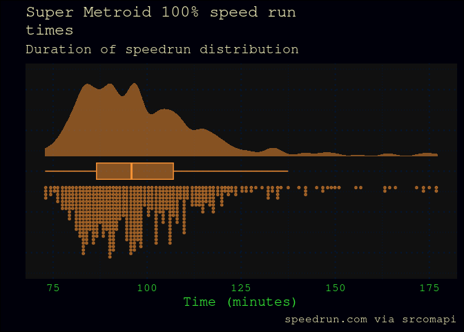
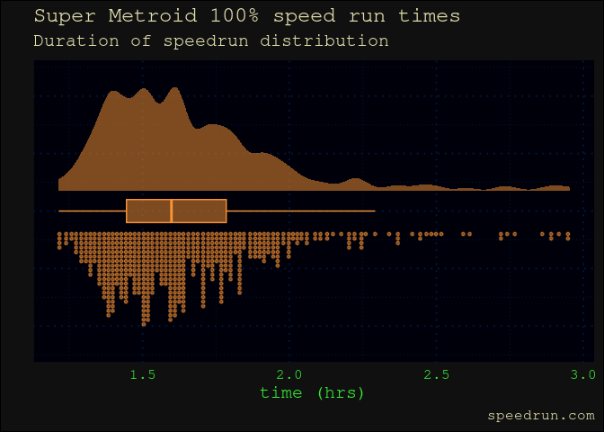

- [supermetroid](#supermetroid)
- [What is Super Metroid?](#what-is-super-metroid)
  - [Super Metroid speed running](#super-metroid-speed-running)
- [Analyses (work in progress)](#analyses-work-in-progress)
- [Super Metroid and speed running](#super-metroid-and-speed-running)
  - [Super Metroid is the top SNES speed runner
    game](#super-metroid-is-the-top-snes-speed-runner-game)
  - [Subway Surfers TikTok phenomenon or good upload
    interface?](#subway-surfers-tiktok-phenomenon-or-good-upload-interface)
- [Run times](#run-times)
  - [Speed run times from
    speedrun.com](#speed-run-times-from-speedruncom)
- [Segment times](#segment-times)
  - [Label chaos](#label-chaos)
  - [Comparison of segments](#comparison-of-segments)
  - [Single segment analyses](#single-segment-analyses)
- [Getting the data](#getting-the-data)
  - [Sources](#sources)
  - [Desired output: `ggplot`-friendly/tidy
    data](#desired-output-ggplot-friendlytidy-data)
    - [Runs](#runs)
    - [Location of players on
      speedrun.com](#location-of-players-on-speedruncom)
    - [Segments for each run from
      splitsio](#segments-for-each-run-from-splitsio)
- [Import pkg & helper functions](#import-pkg--helper-functions)
  - [Last updated](#last-updated)
- [speedrun.com](#speedruncom)
  - [Load runs from 100% leaderboard](#load-runs-from-100-leaderboard)
  - [Run dataframe](#run-dataframe)
    - [Visualise runs](#visualise-runs)
    - [Raincloud](#raincloud)
    - [Write run data from speedrun.com to
      supermetroid](#write-run-data-from-speedruncom-to-supermetroid)
  - [Player data](#player-data)
    - [Location of players on
      speedrun.com](#location-of-players-on-speedruncom-1)
    - [Not all ids are valid](#not-all-ids-are-valid)
- [splits.io](#splitsio)
  - [Load runs and runners](#load-runs-and-runners)
- [Try with converting to a dictionary much
  earlier](#try-with-converting-to-a-dictionary-much-earlier)
  - [Inspect data](#inspect-data)
  - [Run dataframe](#run-dataframe-1)
  - [Try with list of dictionaries](#try-with-list-of-dictionaries)
  - [create segments dataframe](#create-segments-dataframe)
  - [fucking segment labels](#fucking-segment-labels)
- [deertier](#deertier)
- [speedrunslive](#speedrunslive)
- [wikipedia](#wikipedia)
- [later](#later)

<!-- README.md is generated from README.Rmd. Please edit that file -->

# supermetroid

<!-- badges: start -->
<!-- badges: end -->

This is an analysis repository that captures Super Metroid speed run
data from leaderboards and aims to analyse the data to answer the
following question, posed by a runner.

> At what times do Super Metroid 100% speed runs get competitive?

# What is Super Metroid?

> While the exploration-focused platformers known as Metroidvanias
> derive their genre name from two different series, there’s one game
> they’re all judged by. Super Metroid wasn’t the first Metroidvania,
> the first Metroid game also had the focus on exploring a large
> interconnected map and using new abilities to open up new areas, but
> its polish, visual direction, and atmosphere all created a more
> involved experience than its predecessors. Released in 1994, Super
> Metroid’s shadow looms over every game in the genre since… -
> [thegamehoard
> 2022](https://thegamehoard.com/2022/04/24/50-years-of-video-games-super-metroid-snes/)

``` r
# source: wikipedia
knitr::include_graphics("img/Smetroidbox-wiki.png")
```


## Super Metroid speed running

As part of the verification of their speed run results, many players
upload a [video of the run](https://www.youtube.com/embed/7-cj22T2Yu4)
to youtube.

# Analyses (work in progress)

``` r
library(supermetroid)
library(tidyverse) # data science tools
library(knitr) # for html tables
```

# Super Metroid and speed running

## Super Metroid is the top SNES speed runner game

``` r
top_five_vis(base_size = 10)
```


- [ ] convert to coloured barchart, grouped by game, coloured by
  category
- [ ] can we scrape these data?

## Subway Surfers TikTok phenomenon or good upload interface?

``` r
top_games_vis(base_size = 10)
```



- [ ] add platform

# Run times

### Speed run times from speedrun.com

``` r

all_run_raincloud(src_run_df)
#> Warning: Removed 582 rows containing missing values (`stat_slabinterval()`).
#> Warning: Unknown or uninitialised column: `dist`.
#> Unknown or uninitialised column: `dist`.
#> Unknown or uninitialised column: `dist`.
#> Unknown or uninitialised column: `dist`.
#> Unknown or uninitialised column: `dist`.
#> Unknown or uninitialised column: `dist`.
#> Warning: Removed 582 rows containing non-finite values (`stat_boxplot()`).
#> Warning: Removed 582 rows containing missing values (`stat_slabinterval()`).
#> Warning: Unknown or uninitialised column: `dist`.
#> Unknown or uninitialised column: `dist`.
#> Unknown or uninitialised column: `dist`.
#> Unknown or uninitialised column: `dist`.
#> Unknown or uninitialised column: `dist`.
#> Unknown or uninitialised column: `dist`.
```



- [ ] interpretable x axis

# Segment times

## Label chaos

## Comparison of segments

## Single segment analyses

# Getting the data

## Sources

There are several sites where players upload Super Metroid speed running
data.

| site                                                               | api                                                                                                                                           | description (why we’re interested, these assumptions should be checked)              |
|--------------------------------------------------------------------|-----------------------------------------------------------------------------------------------------------------------------------------------|--------------------------------------------------------------------------------------|
| [speedrun](https://www.speedrun.com/supermetroid?h=Any&x=9d8v96lk) | [python](https://github.com/blha303/srcomapi)(how to get historical?) & [curl](https://github.com/glacials/splits-io/blob/master/docs/api.md) | most complete list of speed runs                                                     |
| [splitio](https://splits.io/)                                      | [python](https://github.com/splitio/python-api)                                                                                               | by-segment times for each run, but for a smaller number of runners than speedrun.com |
| [deertier](https://deertier.com/)                                  | there is an api, but I think we can get everything we need with `rvest`                                                                       | super metroid game-specific speed running site                                       |

``` r

tribble(
  ~source, ~runs, ~players,
  "speedrun.com", nrow(src_run_df), NA,
  "splits.io", NA, NA,
  "deertier", NA, NA
) %>% 
  kable()
```

| source       | runs | players |
|:-------------|-----:|:--------|
| speedrun.com |  582 | NA      |
| splits.io    |   NA | NA      |
| deertier     |   NA | NA      |

## Desired output: `ggplot`-friendly/tidy data

Dataframes that describe runs, runners, and, eventually, categories.
Ideally, aggregated across the datasets.

However, this will results in missing data, so specific analyses need to
take that into account, or use source-specific datasets from the
aggregated set with caveats. Linking ids are in italics.

Either way, we need to know what we have in each dataset, and have a
universal schema across datasets.

### Runs

Each row describes one speed run; a player may have multiple runs in a
database.

| run_df      | description                  |
|-------------|------------------------------|
| date        | timestamp of run upload      |
| *run_id*    | unique identifier of run     |
| run_time    | total time of run in s or ms |
| *player_id* | unique identifier of player  |
| rank        | rank of player               |

To build a speed run leaderboard across datasets, we’d need to do some
fancy engineering, so we will focus on source-specific analyses for now.
Each leaderboard comprises runs.

| run_df        | description                                                                                                              |
|---------------|--------------------------------------------------------------------------------------------------------------------------|
| date          | timestamp of run upload                                                                                                  |
| *run_id*      | unique identifier of run                                                                                                 |
| run_time      | total time of run in s or ms                                                                                             |
| *player_id*   | unique identifier of player                                                                                              |
| rank          | rank of player                                                                                                           |
| *src_id*      | speedrun.com id                                                                                                          |
| *sio_id*      | splits.io id                                                                                                             |
| *deertier_id* | deertier id                                                                                                              |
| historical    | if a historical ranking, need to inspect data to see how this should be recorded, possibly a bool, or putting NA in rank |

### Location of players on speedrun.com

| player_df     | description                   |
|---------------|-------------------------------|
| *player_id*   | unique identifier of player   |
| player_handle | human-readable **unique** tag |
| location      | geographic location of player |

### Segments for each run from splitsio

| segment_df | description                                        |
|------------|----------------------------------------------------|
| *run_id*   | unique identifier of run                           |
| segment_id | unique identifier of segment                       |
| t_s        | time in seconds, measured to millisecond precision |

# Import pkg & helper functions

``` python
import srcomapi, srcomapi.datatypes as dt
import pandas as pd
import pickle
import splitsio
```

``` r
library(tidyquant)
library(ggdist) # for rainclouds
library(reticulate) # Python <-> R

# load r functions for this analysis
library(supermetroid)
```

``` python
# helper function: saving an anonymous object in python 
# https://stackoverflow.com/questions/4529815/saving-an-object-data-persistence

def save_object(obj, filename):
    with open(filename, 'wb') as outp:  # Overwrites any existing file.
        pickle.dump(obj, outp, pickle.HIGHEST_PROTOCOL)
```

## Last updated

``` r
# this chunk is evaluated when data is updated

write_rds(today(), "data-raw/readme-updated.rds")
```

``` r
# get last updated

update_date <- read_rds("data-raw/readme-updated.rds")
```

This read me was last updated: 2023-06-03.

# speedrun.com

## Load runs from 100% leaderboard

The game object was too nested to pickle, so runs have been extracted
and saved.

``` python
# get the runs object wrangled above

# data extracted in data-raw/get-src.py

with open('data-raw/src_runs.pkl', 'rb') as inp:
    src_runs = pickle.load(inp)

# argh the fuck, why does this work when it's compiled, but not at the console?!
    
```

``` python
# inspect runs object
type(src_runs)
#> <class 'list'>
len(src_runs)
#> 596
```

``` python

# inspect one element
src_runs[0] 
#> {'place': 1, 'run': {'id': 'z5do82dm', 'weblink': 'https://www.speedrun.com/supermetroid/run/z5do82dm', 'game': 'm1zoemd0', 'level': None, 'category': 'xd1mpewd', 'videos': {'links': [{'uri': 'https://www.youtube.com/watch?v=vBdHFz9gTtM'}]}, 'comment': 'Oats raids always bring me the best luck. YES!!!!', 'status': {'status': 'verified', 'examiner': 'zxzno3ex', 'verify-date': '2021-07-31T17:57:05Z'}, 'players': [{'rel': 'user', 'id': 'zxzno3ex', 'uri': 'https://www.speedrun.com/api/v1/users/zxzno3ex'}], 'date': '2021-07-31', 'submitted': '2021-07-31T17:57:05Z', 'times': {'primary': 'PT1H12M53S', 'primary_t': 4373, 'realtime': 'PT1H12M53S', 'realtime_t': 4373, 'realtime_noloads': None, 'realtime_noloads_t': 0, 'ingame': 'PT42M', 'ingame_t': 2520}, 'system': {'platform': '83exk6l5', 'emulated': False, 'region': None}, 'splits': None, 'values': {'wle6dpr8': '21gezkxl', 'wl3dqoo8': 'jq6eyx3l'}}}
type(src_runs[0])
#> <class 'dict'>
src_runs[0].keys()

# run element is a nested dictionary
#> dict_keys(['place', 'run'])
type(src_runs[0]['run'])
#> <class 'dict'>
src_runs[0]['run'].keys()

#> dict_keys(['id', 'weblink', 'game', 'level', 'category', 'videos', 'comment', 'status', 'players', 'date', 'submitted', 'times', 'system', 'splits', 'values'])
```

``` python

# inspect a few elements
src_runs[0:3] 
#> [{'place': 1, 'run': {'id': 'z5do82dm', 'weblink': 'https://www.speedrun.com/supermetroid/run/z5do82dm', 'game': 'm1zoemd0', 'level': None, 'category': 'xd1mpewd', 'videos': {'links': [{'uri': 'https://www.youtube.com/watch?v=vBdHFz9gTtM'}]}, 'comment': 'Oats raids always bring me the best luck. YES!!!!', 'status': {'status': 'verified', 'examiner': 'zxzno3ex', 'verify-date': '2021-07-31T17:57:05Z'}, 'players': [{'rel': 'user', 'id': 'zxzno3ex', 'uri': 'https://www.speedrun.com/api/v1/users/zxzno3ex'}], 'date': '2021-07-31', 'submitted': '2021-07-31T17:57:05Z', 'times': {'primary': 'PT1H12M53S', 'primary_t': 4373, 'realtime': 'PT1H12M53S', 'realtime_t': 4373, 'realtime_noloads': None, 'realtime_noloads_t': 0, 'ingame': 'PT42M', 'ingame_t': 2520}, 'system': {'platform': '83exk6l5', 'emulated': False, 'region': None}, 'splits': None, 'values': {'wle6dpr8': '21gezkxl', 'wl3dqoo8': 'jq6eyx3l'}}}, {'place': 2, 'run': {'id': 'yo75d4dm', 'weblink': 'https://www.speedrun.com/supermetroid/run/yo75d4dm', 'game': 'm1zoemd0', 'level': None, 'category': 'xd1mpewd', 'videos': None, 'comment': 'video at\r\ndeertier.com\r\nor\r\nyoutube.com/zoasty', 'status': {'status': 'verified', 'examiner': '18v6k4nx', 'verify-date': '2021-07-02T12:31:43Z'}, 'players': [{'rel': 'user', 'id': '18v6k4nx', 'uri': 'https://www.speedrun.com/api/v1/users/18v6k4nx'}], 'date': '2021-02-24', 'submitted': '2021-07-02T12:31:43Z', 'times': {'primary': 'PT1H12M55S', 'primary_t': 4375, 'realtime': 'PT1H12M55S', 'realtime_t': 4375, 'realtime_noloads': None, 'realtime_noloads_t': 0, 'ingame': 'PT42M', 'ingame_t': 2520}, 'system': {'platform': '83exk6l5', 'emulated': False, 'region': None}, 'splits': None, 'values': {'wle6dpr8': '21gezkxl', 'wl3dqoo8': 'jq6eyx3l'}}}, {'place': 3, 'run': {'id': 'm36d0q6m', 'weblink': 'https://www.speedrun.com/supermetroid/run/m36d0q6m', 'game': 'm1zoemd0', 'level': None, 'category': 'xd1mpewd', 'videos': {'links': [{'uri': 'https://www.youtube.com/watch?v=7pqyw6eO5Gc'}]}, 'comment': 'wun twulf', 'status': {'status': 'verified', 'examiner': 'zxz2wy4x', 'verify-date': '2021-12-09T16:05:14Z'}, 'players': [{'rel': 'user', 'id': 'zxz2wy4x', 'uri': 'https://www.speedrun.com/api/v1/users/zxz2wy4x'}], 'date': '2021-12-08', 'submitted': '2021-12-09T16:05:14Z', 'times': {'primary': 'PT1H12M55.930S', 'primary_t': 4375.93, 'realtime': 'PT1H12M55.930S', 'realtime_t': 4375.93, 'realtime_noloads': None, 'realtime_noloads_t': 0, 'ingame': 'PT42M', 'ingame_t': 2520}, 'system': {'platform': '83exk6l5', 'emulated': False, 'region': None}, 'splits': None, 'values': {'wle6dpr8': '21gezkxl', 'wl3dqoo8': 'jq6eyx3l'}}}]
```

## Run dataframe

| src_run_df  | description                                                    | from                                        |
|-------------|----------------------------------------------------------------|---------------------------------------------|
| date        | timestamp of run upload                                        | `runs[index]['run']['date']`                |
| *run_id*    | unique identifier of run                                       | `runs[index]['run']['date']`                |
| run_time    | total time of run in s or ms                                   | `runs[index]['run']['times']['realtime_t']` |
| *player_id* | unique identifier of player                                    | player id == run id, debug extraction       |
| rank        | rank, empty if historical, currently don’t have historical obs | `src_runs[x]['place']`                      |

``` python

n_obs = len(src_runs)

# how to get splits? [src_runs][x]['run']['splits']

# extract elements with list comprehension
src_run_df = pd.DataFrame({
  'run_id' : [src_runs[x]['run']['id'] for x in range(n_obs)],
  # need to inspect what happens to historical ranking
  'rank' : [src_runs[x]['place'] for x in range(n_obs)], 
  't_s' : [src_runs[x]['run']['times']['realtime_t'] for x in range(n_obs)],
  'date' : [src_runs[x]['run']['date'] for x in range(n_obs)],
  'player' : [pd.DataFrame(src_runs[x]['run']['players']).iloc[0,1] for x in range(n_obs)]
})

# inspect runs dataframe
src_run_df.head()
#>      run_id  rank      t_s        date    player
#> 0  z5do82dm     1  4373.00  2021-07-31  zxzno3ex
#> 1  yo75d4dm     2  4375.00  2021-02-24  18v6k4nx
#> 2  m36d0q6m     3  4375.93  2021-12-08  zxz2wy4x
#> 3  m3qo724y     4  4392.00  2023-05-08  xk49m26j
#> 4  y4g31v3y     5  4442.00  2022-12-10  x35ve3kj
```

### Visualise runs

Now we have the data from speedrun.com leaderboard, we can plot the
distribution of runs.

``` r
# get the data from python into R

src_run_raw <- py$src_run_df

all_run_raincloud(src_run_raw)
#> Warning: Removed 596 rows containing missing values (`stat_slabinterval()`).
#> Warning: Unknown or uninitialised column: `dist`.
#> Unknown or uninitialised column: `dist`.
#> Unknown or uninitialised column: `dist`.
#> Unknown or uninitialised column: `dist`.
#> Unknown or uninitialised column: `dist`.
#> Unknown or uninitialised column: `dist`.
#> Warning: Removed 596 rows containing non-finite values (`stat_boxplot()`).
#> Warning: Removed 596 rows containing missing values (`stat_slabinterval()`).
#> Warning: Unknown or uninitialised column: `dist`.
#> Unknown or uninitialised column: `dist`.
#> Unknown or uninitialised column: `dist`.
#> Unknown or uninitialised column: `dist`.
#> Unknown or uninitialised column: `dist`.
#> Unknown or uninitialised column: `dist`.
```


We have a handful of 0 entries and some \> 3 hours.

``` r
# how many runs are really low?
src_run_raw %>% 
  filter(t_s < 4000 | t_s > 3 * 60 * 60)
#>      run_id rank       t_s       date   player
#> 1  mk5q77xm  584  11760.00 2021-10-03 qjnldw4x
#> 2  z05785jm  585  12000.00 2020-05-26 v8lpwk7j
#> 3  zpg3djxz  586  12015.00 2023-01-08 j20563px
#> 4  zp1n1rnz  587  12357.00 2021-04-10 8wk1zz48
#> 5  yor95l1y  588  21003.81 2021-12-24 y8d9w3gx
#> 6  yjp79v7y  589  25483.56 2022-05-05 qjn072qx
#> 7  y6p3gxjm  590 199158.00 2017-06-08 dx3l5p6x
#> 8  y20nprwm  591      0.00 2022-02-23 x7m21p6x
#> 9  znp3nvvm  592      0.00 2022-05-07 8gez077j
#> 10 ywp6dqnz  593      0.00 2018-11-06 kj9oo2vj
#> 11 y21k26wz  594      0.00 2019-12-06 j921z1n8
#> 12 yv8peoxm  595      0.00 2023-02-19 j40o9vw8
#> 13 yl9oenxy  596      0.00 2017-08-02 1xykvdw8
```

The 0 entries are run times where `gametime` was captured, but
`realtime` was not by the tool the player used to record the run. Our
analyses are on `realtime`, so we will exclude these observations.

We are also interest in comparing *speed runners*, as opposed to those
logging playing through the game, which takes some hours.

``` r
(prop_greater_3hrs <- sum(src_run_raw$t_s > 3 * 60 * 60) / nrow(src_run_raw))
#> [1] 0.01174497
```

Since only {r round(prop_greater_3hrs, 2) \* 100}% of runs are greater
than 3 hours, these are negligible, and arguably not *speed* runs. We
will define a Super Metroid speed run, for this analysis, to be a Super
Metroid 100% run that takes under 3 hours.

### Raincloud

``` r
src_run_raw %>%
  filter(
    # remove 0 length runs
    t_s > 0, 
    # exclude runs > 3 hours
    t_s < 3 * 60 * 60) %>%  
  all_run_raincloud()
#> Warning: Removed 582 rows containing missing values (`stat_slabinterval()`).
#> Warning: Unknown or uninitialised column: `dist`.
#> Unknown or uninitialised column: `dist`.
#> Unknown or uninitialised column: `dist`.
#> Unknown or uninitialised column: `dist`.
#> Unknown or uninitialised column: `dist`.
#> Unknown or uninitialised column: `dist`.
#> Warning: Removed 582 rows containing non-finite values (`stat_boxplot()`).
#> Warning: Removed 582 rows containing missing values (`stat_slabinterval()`).
#> Warning: Unknown or uninitialised column: `dist`.
#> Unknown or uninitialised column: `dist`.
#> Unknown or uninitialised column: `dist`.
#> Unknown or uninitialised column: `dist`.
#> Unknown or uninitialised column: `dist`.
#> Unknown or uninitialised column: `dist`.
```


### Write run data from speedrun.com to supermetroid

``` r
# this chunk is evaluated when data is updated
src_run_df <- 
  src_run_raw %>% 
  filter(t_s > 0,t_s < 3 * 60 * 60)


usethis::use_data(src_run_df, overwrite=TRUE)
```

## Player data

### Location of players on speedrun.com

| player_df     | description                   |
|---------------|-------------------------------|
| *player_id*   | unique identifier of player   |
| player_handle | human-readable **unique** tag |
| location      | geographic location of player |

``` python
src_api = srcomapi.SpeedrunCom(); api.debug = 1
#> Error: NameError: name 'api' is not defined
player_locations = []
player_handles = []
players = []
```

``` python
# this loop fails because not all ids are valid


# get a list of player records for each valid player id
src_players = []
for player in src_run_df.player:
  print("loop index")
  print(len(src_players))
  print(player)
  user = src_api.get_user(player)
  src_players.append(user)

# extract player data into dataframe    
#> Error: srcomapi.exceptions.APIRequestException: (404, 'Not Found', 'users/LynxXUnlimited')
players = pd.DataFrame({
  'player_id' : [src_players[x].id for x in range(len(src_players))],
  'player_name' : [src_players[x].name for x in range(len(src_players))],
  'location' : [src_players[x].location['country']['names']['international'] for x in range(len(src_players))] 
})
  
```

``` python
# curiously this works on first three records


# get a list of player records for each valid player id
src_players = []
for player in src_run_df.player[0:3]:
  print("loop index")
  print(len(src_players))
  print(player)
  user = src_api.get_user(player)
  src_players.append(user)

#> loop index
#> 0
#> zxzno3ex
#> loop index
#> 1
#> 18v6k4nx
#> loop index
#> 2
#> zxz2wy4x
```

``` python
# extract player data into dataframe    
src_players_df = pd.DataFrame({
  'player_id' : [src_players[x].id for x in range(len(src_players))],
  'player_name' : [src_players[x].name for x in range(len(src_players))],
  'location' : [src_players[x].location['country']['names']['international'] for x in range(len(src_players))] 
})
  
src_players_df.head()
#>   player_id player_name       location
#> 0  zxzno3ex   ShinyZeni  United States
#> 1  18v6k4nx       zoast          Palau
#> 2  zxz2wy4x  Behemoth87        England
```

### Not all ids are valid

``` python


# get users with length 8 ids 
# filter out ids that don't contain numbers (some are player handles)
# (hopefully these will capture the valid apis)

# the player id extracted does not always match to api
# api uri is also wrong, matches the incorrect player id
src_run_df.player.str.len().value_counts()

# take a look at the records with strings not of length 8
#> 8     510
#> 10     19
#> 9      11
#> 7      10
#> 11      8
#> 6       7
#> 14      6
#> 15      5
#> 13      5
#> 12      4
#> 4       4
#> 5       4
#> 19      1
#> 18      1
#> 16      1
#> Name: player, dtype: int64
src_run_df.assign(id_len = lambda x: x.player.str.len()).query('id_len != 8')
#>        run_id  rank     t_s        date          player  id_len
#> 6    me16939y     7  4485.0  2022-04-03  LynxXUnlimited      14
#> 71   z1j38k7z    72  4955.0  2019-06-02      Flowsouth8      10
#> 98   nz167pwm    99  5031.0  2014-12-11      Yeahboiii5      10
#> 135  9yowdv5z   136  5161.0  2017-02-27     Sweetkid689      11
#> 147  wzpjjkrz   148  5206.0  2017-03-08      Dhaos Tk31      10
#> ..        ...   ...     ...         ...             ...     ...
#> 564  9mrd504z   565  8789.0  2015-05-03      hubert0987      10
#> 567  1zx05jgz   568  8937.0  2015-02-24   Hellmessenger      13
#> 569  pydpj3xy   570  9060.0  2017-01-20      playingg0d      10
#> 571  kz5w6ldz   572  9407.0        None       PinkTeddy       9
#> 573  pm3v2w6z   574  9808.0  2016-10-23     jewelediris      11
#> 
#> [86 rows x 6 columns]
```

# splits.io

## Load runs and runners

``` python
# this chunk is not evaluated 
# to minimise api calls

# get 100% Category Super Metroid game data  
sio_cat = splitsio.Category.from_id("279", historic=True)
save_object(sio_cat, "data-raw/sio_cat.pkl")
```

``` python
# load sio data
with open('data-raw/sio_cat.pkl', 'rb') as inp:
    sio_cat = pickle.load(inp)

# extract runners and run from category
sio_runners = sio_cat.runners()

sio_runs = sio_cat.runs()
```

# Try with converting to a dictionary much earlier

``` python
sio_run_dict_max = 3

sio_run_dicts = [sio_runs[x].to_dict() for x in range(sio_run_dict_max)]

# each element of the list is a dictionary with keys
sio_run_dicts[0].keys()
#> dict_keys(['id', 'srdc_id', 'realtime_duration_ms', 'realtime_sum_of_best_ms', 'gametime_duration_ms', 'gametime_sum_of_best_ms', 'default_timing', 'program', 'attempts', 'image_url', 'parsed_at', 'created_at', 'updated_at', 'video_url', 'game', 'category', 'runners', 'segments', 'histories'])
```

``` r
testing_index <- 3

# find 
```

## Inspect data

``` python
# take a look at a run
sio_runs[0]

# can we call nested elements by index and key?
#> Run(id='ato1', srdc_id=None, realtime_duration_ms=7013075, realtime_sum_of_best_ms=6651338, gametime_duration_ms=5050217, gametime_sum_of_best_ms=4788713, default_timing='real', program='livesplit', attempts=8, image_url=None, parsed_at='2023-06-04T09:38:27.836Z', created_at='2023-06-04T09:38:07.030Z', updated_at='2023-06-04T09:38:27.850Z', video_url=None, game=Game(id='50', name='Super Metroid', shortname='supermetroid'), category=Category(id='279', name='100%'), runners=[Runner(id='89646', twitch_id=None, twitch_name=None, display_name='anatomecha', name='anatomecha')])
type(sio_runs[0])
# I think this is a series object?
#> <class 'splitsio.api.Run'>
print(pd.DataFrame(sio_runs[1:3]))
#>      id srdc_id  ...                                           segments  histories
#> 0  asmc    None  ...  [{'id': '66be0a6c-9c80-4309-8705-843e8ea71aa4'...       None
#> 1  amuv    None  ...  [{'id': 'f847b639-9003-480e-9c5c-51d25e247df5'...       None
#> 
#> [2 rows x 19 columns]
print(pd.DataFrame(sio_runs[1:3]).columns)
#> Index(['id', 'srdc_id', 'realtime_duration_ms', 'realtime_sum_of_best_ms',
#>        'gametime_duration_ms', 'gametime_sum_of_best_ms', 'default_timing',
#>        'program', 'attempts', 'image_url', 'parsed_at', 'created_at',
#>        'updated_at', 'video_url', 'game', 'category', 'runners', 'segments',
#>        'histories'],
#>       dtype='object')
```

``` python
# take a look at a runner
sio_runners[0]
#> Runner(id='284', twitch_id='37537140', twitch_name='dyceron', display_name='Dyceron', name='Dyceron')
```

## Run dataframe

Objective: to wrangle a data frame with run data

| sio_run_df    | description                                                                                                | splitsio                                                                                                             |
|---------------|------------------------------------------------------------------------------------------------------------|----------------------------------------------------------------------------------------------------------------------|
| *run_id*      | splits.io id                                                                                               | `id`                                                                                                                 |
| date          | timestamp of run upload                                                                                    | ? `'created_at', 'parsed_at', 'updated_at'` we’ll use ‘updated_at’ for now, but should check splitsio docs for which |
| run_time      | total time of run in s or ms                                                                               | `realtime_duration_ms`                                                                                               |
| rank          | “historical” if from previous record (nb only applies to speedrun.com); otherwise rank as int, list column | ?                                                                                                                    |
| src_player_id | speedrun.com player id                                                                                     | `srdc_id`                                                                                                            |

## Try with list of dictionaries

``` python
sio_run_dicts = [sio_runs[x].to_dict() for x in range(len(sio_runs))]

# each element is a dictionary with keys
sio_run_dicts[0].keys()
#> dict_keys(['id', 'srdc_id', 'realtime_duration_ms', 'realtime_sum_of_best_ms', 'gametime_duration_ms', 'gametime_sum_of_best_ms', 'default_timing', 'program', 'attempts', 'image_url', 'parsed_at', 'created_at', 'updated_at', 'video_url', 'game', 'category', 'runners', 'segments', 'histories'])
```

``` python
# run id
sio_run_dicts[0].keys()

# get id
#> dict_keys(['id', 'srdc_id', 'realtime_duration_ms', 'realtime_sum_of_best_ms', 'gametime_duration_ms', 'gametime_sum_of_best_ms', 'default_timing', 'program', 'attempts', 'image_url', 'parsed_at', 'created_at', 'updated_at', 'video_url', 'game', 'category', 'runners', 'segments', 'histories'])
sio_run_dicts[0]['id']

# get realtime
#> 'ato1'
sio_run_dicts[0]['realtime_duration_ms']
#> 7013075
```

``` python
# player data
pd.json_normalize(sio_run_dicts[0]['runners'])['id'][0]
#> '89646'
sio_run_player_index = 10 # len(sio_run_dicts)

run_runners_list = [pd.json_normalize(sio_run_dicts[x]['runners']).assign(run_id = sio_runs[x].id) for x in range(len(sio_runs))]

run_runners_concat = pd.concat(run_runners)
#> Error: NameError: name 'run_runners' is not defined
run_runners = run_runners_concat[['display_name', 'name', 'run_id','id']].rename(columns={'id':'player_id', 'name':'player_name'})
#> Error: NameError: name 'run_runners_concat' is not defined
len(run_runners) != len(sio_runs) # :( whyeee
#> Error: NameError: name 'run_runners' is not defined
sio_run_dicts[0].keys()
#> dict_keys(['id', 'srdc_id', 'realtime_duration_ms', 'realtime_sum_of_best_ms', 'gametime_duration_ms', 'gametime_sum_of_best_ms', 'default_timing', 'program', 'attempts', 'image_url', 'parsed_at', 'created_at', 'updated_at', 'video_url', 'game', 'category', 'runners', 'segments', 'histories'])
sio_runs_df = pd.DataFrame({
  'run_id' : [sio_run_dicts[x]['id'] for x in range(len(sio_runs))],
  't_ms' : [sio_run_dicts[x]['realtime_duration_ms'] for x in range(len(sio_runs))],
  'date' : [sio_run_dicts[x]['updated_at'] for x in range(len(sio_runs))],
  'image_url': [sio_run_dicts[x]['image_url'] for x in range(len(sio_runs))],
  'video_url': [sio_run_dicts[x]['video_url'] for x in range(len(sio_runs))]
}).merge(run_runners, on = "run_id", how = 'left').set_index('run_id')

# get segments

#> Error: NameError: name 'run_runners' is not defined
```

``` r
inspect_sio_runs <- py$sio_runs_df %>% select(-contains("url")) %>% 
  select(display_name, everything())
#> Error in eval(expr, envir, enclos): AttributeError: module '__main__' has no attribute 'sio_runs_df'
```

## create segments dataframe

| segment_df | description                                        |
|------------|----------------------------------------------------|
| *run_id*   | unique identifier of run                           |
| segment_id | unique identifier of segment                       |
| t_s        | time in seconds, measured to millisecond precision |

``` python
# first level of segments
type(sio_df['segments'][0])
#> Error: NameError: name 'sio_df' is not defined
len(sio_df['segments'][0])

# second level of segments
#> Error: NameError: name 'sio_df' is not defined
type(sio_df['segments'][0][0])
#> Error: NameError: name 'sio_df' is not defined
sio_df['segments'][0][2].keys()

#> Error: NameError: name 'sio_df' is not defined
segments_list = [pd.DataFrame(sio_df.segments[x]).assign(run_id = sio_df.id[x]) for x in range(sio_df.shape[0]) ]
#> Error: NameError: name 'sio_df' is not defined
segment_raw = pd.concat(segments_list)
#> Error: NameError: name 'segments_list' is not defined
segment_raw.columns
#> Error: NameError: name 'segment_raw' is not defined
segment_raw.shape
#> Error: NameError: name 'segment_raw' is not defined
sio_segments_df = segment_raw.merge(
  sio_runs_df[['player_name', 'player_id']], on = "run_id", how="left")

#> Error: NameError: name 'segment_raw' is not defined
```

``` r
# tidy it up in R before writing it

sio_segments <- py$sio_segments_df
#> Error in eval(expr, envir, enclos): AttributeError: module '__main__' has no attribute 'sio_segments_df'


sio_splits_df <- 
sio_segments %>% 
  select(
    player_name, 
    game_event = display_name, 
    segment_number, 
    realtime_start_ms, 
    segment_id = id,
    run_id,
    player_id,
    everything()) %>% 
  select(-contains("gametime"),
         -contains("reduced"),
         -contains("skipped"), -histories) 
#> Error in eval(expr, envir, enclos): object 'sio_segments' not found
```

``` r
usethis::use_data(sio_splits_df)
```

## fucking segment labels

This could easily be its own vignette, it’s so complicated.

# deertier

# speedrunslive

# wikipedia

# later

- [ ] You’ll still need to render `README.Rmd` regularly, to keep
  `README.md` up-to-date. `devtools::build_readme()` is handy for this.
  You could also use GitHub Actions to re-render `README.Rmd` every time
  you push. An example workflow can be found here:
  <https://github.com/r-lib/actions/tree/v1/examples>.
