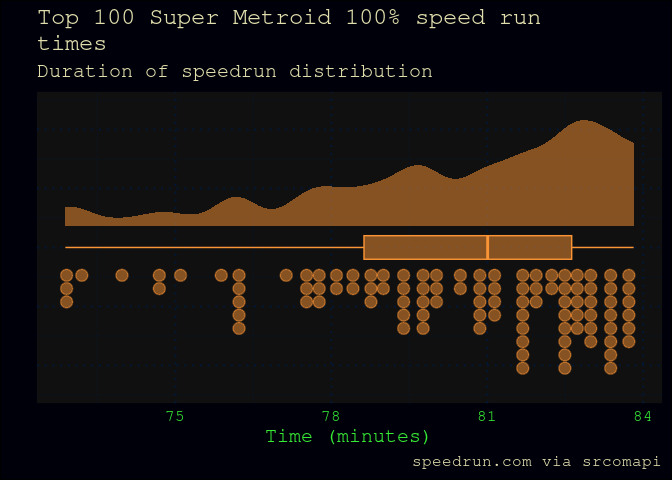
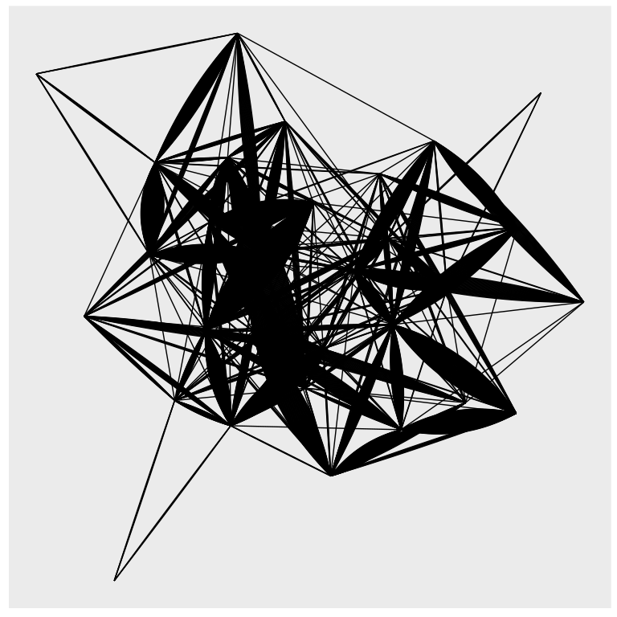

- [supermetroid](#supermetroid)
- [What is Super Metroid?](#what-is-super-metroid)
  - [Super Metroid speed running](#super-metroid-speed-running)
- [Analyses (work in progress)](#analyses-work-in-progress)
  - [Vignettes](#vignettes)
  - [Speed run times from
    speedrun.com](#speed-run-times-from-speedruncom)
  - [Where are Super Metroid players?](#where-are-super-metroid-players)
  - [Routes players take](#routes-players-take)
    - [Different routes](#different-routes)
    - [Missingness of routes](#missingness-of-routes)
  - [Super Metroid and speed running](#super-metroid-and-speed-running)
    - [Super Metroid is the top SNES speed runner
      game](#super-metroid-is-the-top-snes-speed-runner-game)
    - [Subway Surfers TikTok phenomenon or good upload
      interface?](#subway-surfers-tiktok-phenomenon-or-good-upload-interface)

<!-- README.md is generated from README.Rmd. Please edit that file -->

# supermetroid

<!-- badges: start -->
<!-- badges: end -->

This is an analysis repository accompanies [PyData Copenhagen June
2023](https://www.meetup.com/pydata-copenhagen/events/294210771/). Super
Metroid speed run data is captured from leaderboards, and analysed to
answer the following question, posed by a player, that is, a Super
Metroid speed runner.

> At what times do Super Metroid 100% speed runs get competitive?

# What is Super Metroid?

> While the exploration-focused platformers known as Metroidvanias
> derive their genre name from two different series, there’s one game
> they’re all judged by. Super Metroid wasn’t the first Metroidvania,
> the first Metroid game also had the focus on exploring a large
> interconnected map and using new abilities to open up new areas, but
> its polish, visual direction, and atmosphere all created a more
> involved experience than its predecessors. Released in 1994, Super
> Metroid’s shadow looms over every game in the genre since… -
> [thegamehoard
> 2022](https://thegamehoard.com/2022/04/24/50-years-of-video-games-super-metroid-snes/)

source: wikipedia

## Super Metroid speed running

As part of the verification of their speed run results, many players
upload a [video of the run](https://www.youtube.com/embed/7-cj22T2Yu4)
to youtube.

# Analyses (work in progress)

### Vignettes

| Vignette           | Description                                                                              |
|--------------------|------------------------------------------------------------------------------------------|
| data schema        | Plan for what data to extract for analysis                                               |
| player-rank        | Combine speedrun.com and splits.io data                                                  |
| src                | Scrape supermetroid.com data using `srcomapi`                                            |
| sio                | Scrape splits.io data using `splitsio`; data is not labelled in this vignette. Raw data. |
| splits             | Use anatomecha’s labels to update split strings                                          |
| route-matching     | Explore the missingness of routes recorded by players                                    |
| route-graph        | Graphs of routes players take                                                            |
| identifying-routes | Classifying routes players take                                                          |
| player-locations   | Exploring differences in players across locations                                        |

### Speed run times from speedrun.com

- [ ] interpretable x axis

### Where are Super Metroid players?

    #> Error in UseMethod("rename"): no applicable method for 'rename' applied to an object of class "function"

## Routes players take

### Different routes

### Missingness of routes

#### Exploratory graphs

#### Analysis graph

## Super Metroid and speed running

### Super Metroid is the top SNES speed runner game

- [ ] convert to coloured barchart, grouped by game, coloured by
  category
- [ ] how can we scrape these data?

### Subway Surfers TikTok phenomenon or good upload interface?

