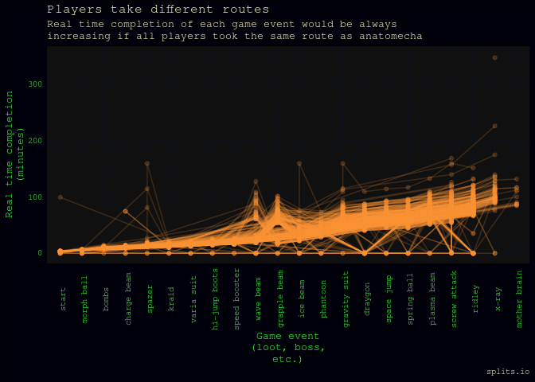

- [supermetroid](#supermetroid)
- [What is Super Metroid?](#what-is-super-metroid)
  - [Super Metroid speed running](#super-metroid-speed-running)
    - [Open Python speed runner API
      implementations](#open-python-speed-runner-api-implementations)
- [Analyses (work in progress)](#analyses-work-in-progress)
  - [Colour palette is in experimental/grab whatever colours
    phase](#colour-palette-is-in-experimentalgrab-whatever-colours-phase)
    - [Vignettes](#vignettes)
    - [Speed run times from
      speedrun.com](#speed-run-times-from-speedruncom)
    - [Where are Super Metroid
      players?](#where-are-super-metroid-players)
  - [Routes players take](#routes-players-take)
    - [Different routes](#different-routes)
    - [Missingness of routes](#missingness-of-routes)
  - [All the runs](#all-the-runs)
  - [Super Metroid and speed running](#super-metroid-and-speed-running)
    - [Super Metroid is the top SNES speed runner
      game](#super-metroid-is-the-top-snes-speed-runner-game)
    - [Subway Surfers TikTok phenomenon or good upload
      interface?](#subway-surfers-tiktok-phenomenon-or-good-upload-interface)

<!-- README.md is generated from README.Rmd. Please edit that file -->

# supermetroid

<!-- badges: start -->
<!-- badges: end -->

This packaged analysis accompanies [PyData Copenhagen June
2023](https://www.meetup.com/pydata-copenhagen/events/294210771/).

Super Metroid speed run data is captured from leaderboards, and analysed
to answer the following question, posed by `anatomecha`, a Super Metroid
speed runner.

> At what times do Super Metroid 100% speed runs get competitive?

# What is Super Metroid?

> While the exploration-focused platformers known as Metroidvanias
> derive their genre name from two different series, there’s one game
> they’re all judged by. Super Metroid wasn’t the first Metroidvania,
> the first Metroid game also had the focus on exploring a large
> interconnected map and using new abilities to open up new areas, but
> its polish, visual direction, and atmosphere all created a more
> involved experience than its predecessors. Released in 1994, Super
> Metroid’s shadow looms over every game in the genre since… -
> [thegamehoard
> 2022](https://thegamehoard.com/2022/04/24/50-years-of-video-games-super-metroid-snes/)

source: wikipedia

## Super Metroid speed running

As part of the verification of their speed run results, many players
upload a [video of the run](https://www.youtube.com/embed/7-cj22T2Yu4)
to youtube.

<iframe width="560" height="315" src="https://www.youtube.com/embed/hNglm3KxCHQ" title="YouTube video player" frameborder="0" allow="accelerometer; autoplay; clipboard-write; encrypted-media; gyroscope; picture-in-picture; web-share" allowfullscreen>
</iframe>

This analysis focuses on 100% speedruns wherein players traverse a map
using different routes to collect all loot and defeat all bosses. Speed
runners try to do this as fast as possible, and log their results on
leaderboards such as
[speedrun.com](https://www.speedrun.com/supermetroid?h=100&x=xd1mpewd)
or splitsio.

A core feature of the game is that there are many routes through the
map. These routes are often hidden in seemingly impassable walls, or
require solving a puzzle.

image source: metroid.retropixel.net

Speed runners hone their skills by mastering techniques to improve their
speed in collecting all loot and defeating all bosses in a 100% run
through the game.

In addition to ranking data from [speedrun.com](https://speedrun.com/)’s
leaderboards, this analysis incorporates timepoints observed for game
events (of the player’s choosing, frustratingly).

Speed runners use this open source plugin for the open source emulator
favoured by SNES Super Metroid (1994) speed runners. These observations
are captured in a .lss file that can be uploaded to
[splitsio](https://splits.io/).

### Open Python speed runner API implementations

Jeremy Silver maintains a Python implentation
[`splitsio`](https://github.com/jeremander/splitsio) of the [REST
API](https://github.com/glacials/splits-io/blob/master/docs/api.md) that
provides players’ timepoint observations of game events from
[splitsio](https://splits.io/). @jeremander’s consultation on this
analysis provided key answers to questions of [what was and was not
possible with the
data](https://github.com/jeremander/splitsio/issues/1).

Player ranks from speedrun.com were accessed via the Python
implementation [`srcomapi`](https://github.com/blha303/srcomapi) of the
[REST API](https://github.com/speedruncomorg/api) for
[speedrun.com](https://speedrun.com/).

# Analyses (work in progress)

## Colour palette is in experimental/grab whatever colours phase

<a href="https://tenor.com/view/no-sir-i-dont-like-it-horse-gif-10436793">No
Sir I Dont Like It GIF</a>from
<a href="https://tenor.com/search/no+sir-gifs">No Sir GIFs</a>

### Vignettes

| Vignette           | Description                                                                              |
|--------------------|------------------------------------------------------------------------------------------|
| data schema        | Plan for what data to extract for analysis                                               |
| player-rank        | Combine speedrun.com and splits.io data                                                  |
| src                | Scrape supermetroid.com data using `srcomapi`                                            |
| sio                | Scrape splits.io data using `splitsio`; data is not labelled in this vignette. Raw data. |
| splits             | Use anatomecha’s labels to update split strings                                          |
| route-matching     | Explore the missingness of routes recorded by players                                    |
| route-graph        | Graphs of routes players take                                                            |
| identifying-routes | Classifying routes players take                                                          |
| player-locations   | Exploring differences in players across locations                                        |

### Speed run times from speedrun.com

- [ ] interpretable x axis

### Where are Super Metroid players?

    #> Error in UseMethod("rename"): no applicable method for 'rename' applied to an object of class "function"

## Routes players take

### Different routes

### Missingness of routes

#### Exploratory graphs

##### Too messy

##### Need order

##### Need direction

##### Too many nodes for EDA

#### Analysis graph

## All the runs

## Super Metroid and speed running

### Super Metroid is the top SNES speed runner game

- [ ] convert to coloured barchart, grouped by game, coloured by
  category
- [ ] how can we scrape these data?

### Subway Surfers TikTok phenomenon or good upload interface?

